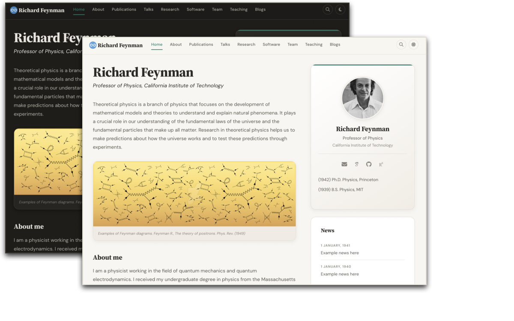
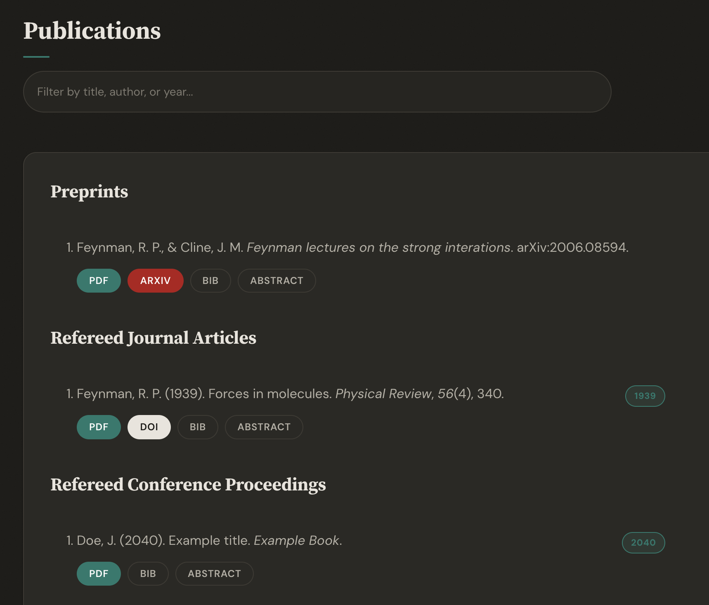

# A website template for academics

  

## Features

* **Editorial design** — Source Serif headings, DM Sans body text, warm parchment palette with subtle noise texture
* **Dark mode** — toggle in navbar or auto-detect from system preference, persists across visits
* **Publication management** — auto-generated from BibTeX via Jekyll Scholar, with search/filter bar and year badges
* **Site-wide search** — press `Cmd+K` (or click the magnifying glass) to search all pages instantly
* **Copy BibTeX** — hover any bibtex block to reveal a one-click copy button
* **Easy setup** — run `./setup.sh` or edit the numbered steps in `_config.yml`
* **Responsive** — CSS Grid layouts that adapt from desktop to mobile
* **Font Awesome 6 + Academicons** — email, Google Scholar, GitHub, ORCID, and more
* **Frosted glass navbar** — with active page indicator and scroll shadow
* **Smooth interactions** — animated link underlines, card hover lift, image zoom, back-to-top button

## Screenshots

| | |
|:---:|:---:|
|  |  |
| Publications with search & year badges | Team page with card grid |
|  | |
| Site-wide search (Cmd+K) | |

## Quick Start

1. **Fork** [this repository](https://github.com/sbryngelson/academic-website-template)
2. **Install** [Jekyll](https://jekyllrb.com/docs/installation/) and run `bundle install`
3. **Configure** your site — either:
   * Run `./setup.sh` for an interactive setup, or
   * Edit `_config.yml` directly (follow Steps 1-4 in the file)
4. **Add your publications** to `assets/ref.bib`
5. **Customize** data files in `_data/` (team members, news, awards, etc.)
6. **Preview** with `bundle exec jekyll serve` at `localhost:4000`

## Customization

### _config.yml

The config file is organized into 4 numbered steps:
1. **Your Identity** — name, title, institution, email, photo
2. **Your Links** — Google Scholar, GitHub, ORCID, Twitter, LinkedIn, CV
3. **Site Settings** — accent color, dark mode toggle, analytics
4. **Your Pages** — comment out any pages you don't need

### Data Files (_data/)

| File | Purpose |
|------|---------|
| `team_members.yml` | Current students and postdocs |
| `alumni.yml` | Former lab members |
| `news.yml` | News items (3 most recent shown on home) |
| `awards.yml` | Awards and honors |
| `grants.yml` | Grants and funding |
| `funders.yml` | Funder logos |
| `people.yml` | Students and mentees |
| `pi.yml` | Optional: detailed education for About page |

Each file has inline comments explaining every field.

### Pages

All pages are in `_pages/`. Edit the Markdown content directly. Pages use the `gridlay` layout by default.

### Accent Color & Dark Mode

Set `accent_color` in `_config.yml` to change the theme color (links, buttons, highlights). Set `dark_mode: false` to disable the dark mode toggle.

### Advanced: CSS & JS Customization

The site uses modular SASS in `_sass/` organized into base, components, layouts, and utilities. To modify:

1. Edit files in `_sass/` — changes are picked up by Jekyll's SASS compiler
2. For JavaScript changes, edit `assets/js/site.js` then run `npm run build`
3. Pre-built JS is committed, so `npm` is only needed if you modify the JS source

## Publications

Publications are managed via [Jekyll Scholar](https://github.com/inukshuk/jekyll-scholar) using BibTeX. Edit `assets/ref.bib` with your references. The publications page includes:

* **Search bar** — filter by title, author, or year
* **Year badges** — quick visual scanning
* **Pill buttons** — PDF, DOI, arXiv, BIB, Abstract
* **Copy to clipboard** — hover a BibTeX block to copy
* **Smooth expand/collapse** — for abstracts and BibTeX entries

Update `scholar.last_name` and `scholar.first_name` in `_config.yml` to auto-bold your name.

## Hosting

### GitHub Pages

Fork this repo as `your_username.github.io` and push. GitHub Pages will build and host it automatically. Note: Jekyll Scholar requires building locally — use the `Rakefile` or a GitHub Action.

### Custom Domain

Purchase a domain, update the `CNAME` file, and configure DNS to point to GitHub Pages. See [GitHub's guide](https://docs.github.com/en/pages/configuring-a-custom-domain-for-your-github-pages-site).

### Self-Hosting

Build locally with `bundle exec jekyll serve`, then upload the `_site/` directory to your server. Set `url` and `baseurl` in `_config.yml` accordingly.

## Upgrading

If you're coming from the previous version of this template, see [UPGRADING.md](UPGRADING.md) for migration instructions.

## Used by 200+ academics worldwide

<a href="https://ilafly.github.io/" target="_blank">★</a>
<a href="https://i-vesseg.github.io/" target="_blank">★</a>
<a href="https://xfangsn.github.io/" target="_blank">★</a>
<a href="https://joshuagob.github.io" target="_blank">★</a>
<a href="https://bczheng.com/" target="_blank">★</a>
<a href="https://bazilinskyy.github.io/" target="_blank">★</a>
<a href="https://www.coreytcallaghan.com/" target="_blank">★</a>
<a href="https://minseoksong.github.io/" target="_blank">★</a>
<a href="https://acme-group-cmu.github.io/" target="_blank">★</a>
<a href="https://barrylee36.github.io/" target="_blank">★</a>
<a href="https://adisun94.github.io/" target="_blank">★</a>
<a href="https://comp-physics.group" target="_blank">★</a>
<a href="https://spike.doc.ic.ac.uk/" target="_blank">★</a>
<a href="http://www.msc.univ-paris-diderot.fr/~berhanu/" target="_blank">★</a>
<a href="https://mashadab.github.io/" target="_blank">★</a>
<a href="https://home.iitk.ac.in/~lalit/" target="_blank">★</a>
<a href="https://ethan-pickering.github.io/" target="_blank">★</a>
<a href="https://pedro-dm-gomes.github.io/" target="_blank">★</a>
<a href="https://3tbk.github.io/3tbk/" target="_blank">★</a>
<a href="https://felipesua.github.io/" target="_blank">★</a>
<a href="https://shivvrat.github.io/" target="_blank">★</a>
<a href="https://ritamraha.github.io/" target="_blank">★</a>
<a href="https://matsesseldeurs.github.io/" target="_blank">★</a>
<a href="https://michelleblom.github.io/" target="_blank">★</a>
<a href="https://jrd971000.github.io/" target="_blank">★</a>
<a href="https://melashri.net/" target="_blank">★</a>
<a href="https://sahatulika15.github.io" target="_blank">★</a>
<a href="https://mzhanglab.github.io" target="_blank">★</a>
<a href="https://soar-lab.github.io" target="_blank">★</a>
<a href="https://azharghafoor.github.io/" target="_blank">★</a>
<a href="https://hyunwoo.info/" target="_blank">★</a>
<a href="https://computervision0.github.io/" target="_blank">★</a>
<a href="https://adrashid.github.io/personal-webpage/index.html" target="_blank">★</a>
<a href="https://aleemkhan62.github.io/" target="_blank">★</a>
<a href="https://vaibhavb007.github.io/" target="_blank">★</a>
<a href="https://gabry993.github.io/" target="_blank">★</a>
<a href="https://shantnuu.github.io/" target="_blank">★</a>
<a href="https://wenbinluomath.github.io/" target="_blank">★</a>
<a href="https://aibio-lab.github.io/" target="_blank">★</a>
<a href="https://dartsushi.github.io/" target="_blank">★</a>
<a href="https://efstathia-soufleri.github.io/" target="_blank">★</a>
<a href="https://zchoffin.github.io/" target="_blank">★</a>
<a href="https://wangyb97.github.io/" target="_blank">★</a>
<a href="https://sgleem.github.io/" target="_blank">★</a>
<a href="https://has97.github.io/" target="_blank">★</a>
<a href="https://albertgassol1.github.io/" target="_blank">★</a>
<a href="https://seanpark05.github.io/" target="_blank">★</a>
<a href="https://miki998.github.io/" target="_blank">★</a>
<a href="https://wilfonba.github.io/" target="_blank">★</a>
<a href="https://saharnazb.github.io/" target="_blank">★</a>
<a href="https://mvmacfarlane.github.io/" target="_blank">★</a>
<a href="https://saharnaz.org/" target="_blank">★</a>
<a href="https://www.isnicholas.com/" target="_blank">★</a>
<a href="https://jojox666.github.io/" target="_blank">★</a>
<a href="https://zhiyu7.github.io/" target="_blank">★</a>
<a href="https://awen-li.github.io/" target="_blank">★</a>
<a href="https://yukiiwong.github.io/" target="_blank">★</a>
<a href="https://joeyleehk.github.io/" target="_blank">★</a>
<a href="https://fabayocbocjr.github.io/" target="_blank">★</a>
<a href="https://www.quantumcookie.xyz/" target="_blank">★</a>
<a href="https://adityanandy.github.io/" target="_blank">★</a>
<a href="https://jlastro.github.io/" target="_blank">★</a>
<a href="https://yunzhe-li.top/" target="_blank">★</a>
<a href="https://xia-hu.github.io/" target="_blank">★</a>
<a href="https://p-bajpai.github.io/" target="_blank">★</a>
<a href="https://aashen12.github.io/" target="_blank">★</a>
<a href="https://Abdurrahheem.github.io/" target="_blank">★</a>
<a href="https://abhimanyu911.github.io/" target="_blank">★</a>
<a href="https://abhishek-sehgal.github.io/" target="_blank">★</a>
<a href="https://adityaIyerramesh98.github.io/" target="_blank">★</a>
<a href="https://AdityaSinghDevs.github.io/" target="_blank">★</a>
<a href="https://aipsita.github.io/" target="_blank">★</a>
<a href="https://albertopadovan.github.io/" target="_blank">★</a>
<a href="https://alirezanorouziazad.github.io/" target="_blank">★</a>
<a href="https://amy-tabb.github.io/" target="_blank">★</a>
<a href="https://anedelin.github.io/" target="_blank">★</a>
<a href="https://ansharora7.github.io/" target="_blank">★</a>
<a href="https://avadapal.github.io/" target="_blank">★</a>
<a href="https://avibagchi.github.io/" target="_blank">★</a>
<a href="https://bc1032.github.io/" target="_blank">★</a>
<a href="https://BDalheimer.github.io/" target="_blank">★</a>
<a href="https://Bennibraun.github.io/" target="_blank">★</a>
<a href="https://binbin-xie.github.io/" target="_blank">★</a>
<a href="https://BiomedLabUGgt.github.io/" target="_blank">★</a>
<a href="https://c752334430.github.io/" target="_blank">★</a>
<a href="https://Chemical118.github.io/" target="_blank">★</a>
<a href="https://chihaoy.github.io/" target="_blank">★</a>
<a href="https://cjaynjoku.github.io/" target="_blank">★</a>
<a href="https://DennisWayo.github.io/" target="_blank">★</a>
<a href="https://dginsberg.github.io/" target="_blank">★</a>
<a href="https://dgiovanis.github.io/" target="_blank">★</a>
<a href="https://donghuison.github.io/" target="_blank">★</a>
<a href="https://donghuixin.github.io/" target="_blank">★</a>
<a href="https://drgHannah.github.io/" target="_blank">★</a>
<a href="https://DrWeiChen.github.io/" target="_blank">★</a>
<a href="https://econpotter.github.io/" target="_blank">★</a>
<a href="https://elitalobo.github.io/" target="_blank">★</a>
<a href="https://emilyvansyoc.github.io/" target="_blank">★</a>
<a href="https://Erd-ling.github.io/" target="_blank">★</a>
<a href="https://estimation-control-learning-laboratory.github.io/" target="_blank">★</a>
<a href="https://EthanJ666.github.io/" target="_blank">★</a>
<a href="https://f-farhan.github.io/" target="_blank">★</a>
<a href="https://fekaputra.github.io/" target="_blank">★</a>
<a href="https://FishyguyNeel.github.io/" target="_blank">★</a>
<a href="https://flampouris.github.io/" target="_blank">★</a>
<a href="https://flavio2018.github.io/" target="_blank">★</a>
<a href="https://Frellaa.github.io/" target="_blank">★</a>
<a href="https://gabrielpachecoribeiro.github.io/" target="_blank">★</a>
<a href="https://gcg-helsinki.github.io/" target="_blank">★</a>
<a href="https://giorgioarcara.github.io/" target="_blank">★</a>
<a href="https://gmtang1212.github.io/" target="_blank">★</a>
<a href="https://gmurtaza404.github.io/" target="_blank">★</a>
<a href="https://Grupo-MATE.github.io/" target="_blank">★</a>
<a href="https://guancai.github.io/" target="_blank">★</a>
<a href="https://guharoysayak.github.io/" target="_blank">★</a>
<a href="https://haochey.github.io/" target="_blank">★</a>
<a href="https://HC-teemo.github.io/" target="_blank">★</a>
<a href="https://heymarco.github.io/" target="_blank">★</a>
<a href="https://hkkaushik.github.io/" target="_blank">★</a>
<a href="https://HORIZON-COVER.github.io/" target="_blank">★</a>
<a href="https://hrositi.github.io/" target="_blank">★</a>
<a href="https://hsparkastro.github.io/" target="_blank">★</a>
<a href="https://hyojoonkim.github.io/" target="_blank">★</a>
<a href="https://JamesL404.github.io/" target="_blank">★</a>
<a href="https://jasonarothman.github.io/" target="_blank">★</a>
<a href="https://Jeffery-Zhou.github.io/" target="_blank">★</a>
<a href="https://jianxyou.github.io/" target="_blank">★</a>
<a href="https://Jiawei-sn.github.io/" target="_blank">★</a>
<a href="https://jortizcs.github.io/" target="_blank">★</a>
<a href="https://jtonos.github.io/" target="_blank">★</a>
<a href="https://JudithBouman2412.github.io/" target="_blank">★</a>
<a href="https://jujubonda.github.io/" target="_blank">★</a>
<a href="https://jumeike.github.io/" target="_blank">★</a>
<a href="https://Kadle11.github.io/" target="_blank">★</a>
<a href="https://KaihangShi.github.io/" target="_blank">★</a>
<a href="https://KALU-KELECHI-GABRIEL.github.io/" target="_blank">★</a>
<a href="https://Khris-VI.github.io/" target="_blank">★</a>
<a href="https://KieuTruong.github.io/" target="_blank">★</a>
<a href="https://Koromonnnnnnnn.github.io/" target="_blank">★</a>
<a href="https://ktvank.github.io/" target="_blank">★</a>
<a href="https://Kunlun-Zhu.github.io/" target="_blank">★</a>
<a href="https://kwakkyoleen.github.io/" target="_blank">★</a>
<a href="https://leowangx2013.github.io/" target="_blank">★</a>
<a href="https://lokingdav.github.io/" target="_blank">★</a>
<a href="https://ltinphan.github.io/" target="_blank">★</a>
<a href="https://lzy37ld.github.io/" target="_blank">★</a>
<a href="https://manshri.github.io/" target="_blank">★</a>
<a href="https://martinezach.github.io/" target="_blank">★</a>
<a href="https://minhphd.github.io/" target="_blank">★</a>
<a href="https://mohamed-s-ibrahim.github.io/" target="_blank">★</a>
<a href="https://mohammedaflah.github.io/" target="_blank">★</a>
<a href="https://monroyaume5.github.io/" target="_blank">★</a>
<a href="https://mrajiullah.github.io/" target="_blank">★</a>
<a href="https://msstate-athena.github.io/" target="_blank">★</a>
<a href="https://mvanwyngarden.github.io/" target="_blank">★</a>
<a href="https://Naeele.github.io/" target="_blank">★</a>
<a href="https://Nebularaid2000.github.io/" target="_blank">★</a>
<a href="https://neuronpain.github.io/" target="_blank">★</a>
<a href="https://NickJi98.github.io/" target="_blank">★</a>
<a href="https://noahzegna.github.io/" target="_blank">★</a>
<a href="https://overlorde.github.io/" target="_blank">★</a>
<a href="https://p4rkerw.github.io/" target="_blank">★</a>
<a href="https://Penghuihuang2000.github.io/" target="_blank">★</a>
<a href="https://Pragati-Meshram.github.io/" target="_blank">★</a>
<a href="https://qianhuimen.github.io/" target="_blank">★</a>
<a href="https://qzkiyoshi.github.io/" target="_blank">★</a>
<a href="https://ricethchang.github.io/" target="_blank">★</a>
<a href="https://robenlunardi.github.io/" target="_blank">★</a>
<a href="https://royess.github.io/" target="_blank">★</a>
<a href="https://rupendra248.github.io/" target="_blank">★</a>
<a href="https://SantiagoxSosa.github.io/" target="_blank">★</a>
<a href="https://saorisakaue.github.io/" target="_blank">★</a>
<a href="https://SelzerConst.github.io/" target="_blank">★</a>
<a href="https://sherdencooper.github.io/" target="_blank">★</a>
<a href="https://shsjxzh.github.io/" target="_blank">★</a>
<a href="https://Smadx.github.io/" target="_blank">★</a>
<a href="https://sophie-carneiro.github.io/" target="_blank">★</a>
<a href="https://ssun32.github.io/" target="_blank">★</a>
<a href="https://st-eislab.github.io/" target="_blank">★</a>
<a href="https://suprovo97.github.io/" target="_blank">★</a>
<a href="https://takouajendoubi.github.io/" target="_blank">★</a>
<a href="https://ThomasMartinez0.github.io/" target="_blank">★</a>
<a href="https://thu-gyt.github.io/" target="_blank">★</a>
<a href="https://tokeron.github.io/" target="_blank">★</a>
<a href="https://ttadano.github.io/" target="_blank">★</a>
<a href="https://valentinsix.github.io/" target="_blank">★</a>
<a href="https://victorolaiya.github.io/" target="_blank">★</a>
<a href="https://vmetsis.github.io/" target="_blank">★</a>
<a href="https://wanganzhi.github.io/" target="_blank">★</a>
<a href="https://wjin4.github.io/" target="_blank">★</a>
<a href="https://wufan-here.github.io/" target="_blank">★</a>
<a href="https://wumirose.github.io/" target="_blank">★</a>
<a href="https://xianzhangchen.github.io/" target="_blank">★</a>
<a href="https://xietian1.github.io/" target="_blank">★</a>
<a href="https://Xueyi-Wang.github.io/" target="_blank">★</a>
<a href="https://xyhanO.github.io/" target="_blank">★</a>
<a href="https://yasserfarouk.github.io/" target="_blank">★</a>
<a href="https://yewenC.github.io/" target="_blank">★</a>
<a href="https://yilevine.github.io/" target="_blank">★</a>
<a href="https://ykl7.github.io/" target="_blank">★</a>
<a href="https://yminzhang.github.io/" target="_blank">★</a>
<a href="https://yuminglab.github.io/" target="_blank">★</a>
<a href="https://zeyuD.github.io/" target="_blank">★</a>
<a href="https://zhoulongyu.github.io/" target="_blank">★</a>

__If you are using this template, feel free to share your site with me, and I'll add it here!__

## Alternatives

* [Minimal mistakes](https://mmistakes.github.io/minimal-mistakes/)
* [al-folio](https://github.com/alshedivat/al-folio)
* [academicpages](https://academicpages.github.io/)

## Acknowledgment

I credit the [Allen Lab](https://www.allanlab.org/) for creating a beautiful academic research group webpage. Many parts of this site were adopted or copied from their laboratory webpage.

## License

MIT
